# Jenkins-ITI Day2-Lab2

4. configure jenkins image to run docker commands on your hos docker daemon
    ```groovy
    # Use the official Jenkins image as the base image
    FROM jenkins/jenkins:lts

    # Install the Docker CE in the Jenkins container
    USER root
    RUN apt-get update && apt-get install -y apt-transport-https ca-certificates curl gnupg-agent software-properties-common
    RUN curl -fsSL https://download.docker.com/linux/debian/gpg | apt-key add -
    RUN add-apt-repository \
        "deb [arch=amd64] https://download.docker.com/linux/debian \
        $(lsb_release -cs) \
        stable"
    RUN apt-get update && apt-get install -y docker-ce

    RUN usermod -aG docker jenkins
    ```
    ```bash
    sudo docker build -t  custom-jenkins .
    ```
    - 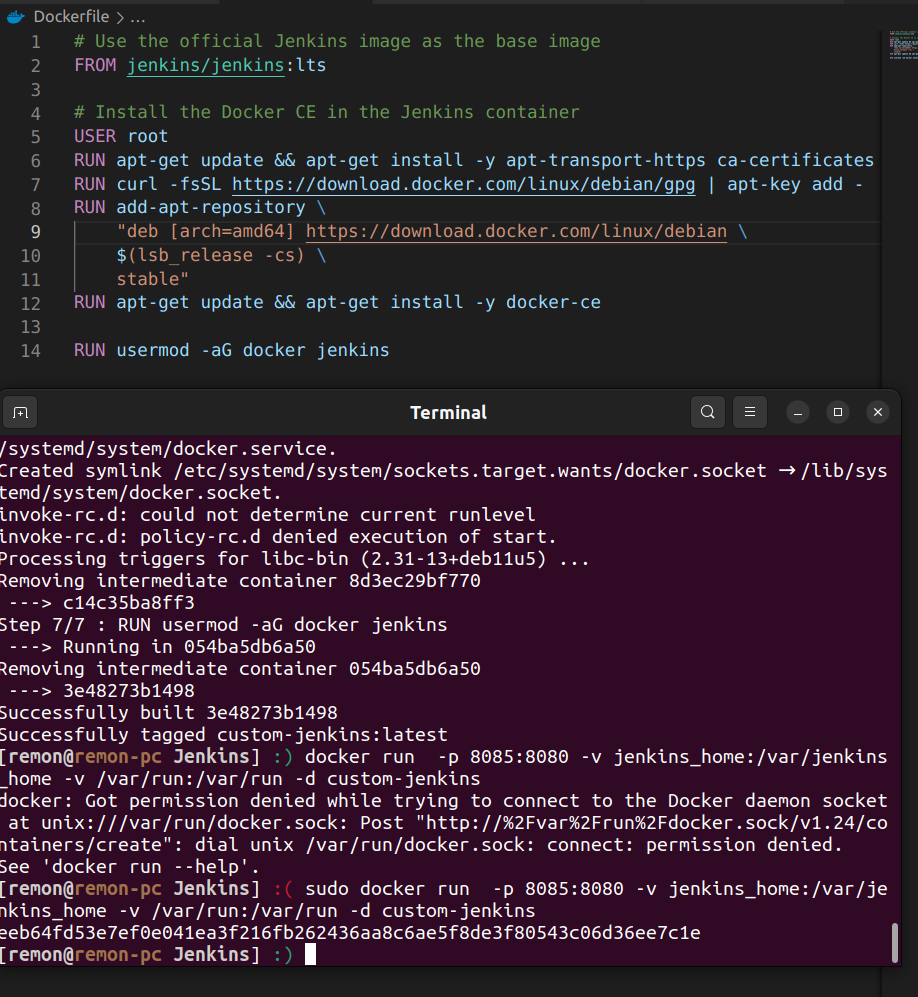

<br/>

5. create CI/CD for this repo https://github.com/mahmoud254/jenkins_nodejs_example.git

    ```groovy
        pipeline {

            agent any

            stages {
                stage('CI') {
                    steps {
                        
                        git url: 'https://github.com/95remon/jenkins_nodejs_example', branch: 'master'
                        
                        
                        withCredentials([usernamePassword(credentialsId: 'dockerhub', passwordVariable: 'PASS', usernameVariable: 'USER')]){
                            sh """
                                docker login -u ${USER} -p ${PASS}
                                docker build . -f dockerfile -t 95remon/jenkins_nodejs
                                docker push 95remon/jenkins_nodejs
                            """
                        }
                    }
                }
                
                
                stage('CD') {
                    steps {
                        
                        withCredentials([usernamePassword(credentialsId: 'dockerhub', passwordVariable: 'PASS', usernameVariable: 'USER')]){
                            sh """
                                docker login -u ${USER} -p ${PASS}
                                docker run -d -p 3000:3000 95remon/jenkins_nodejs
                            """
                        }
                    }
                }
            }
        }

    ```
    - 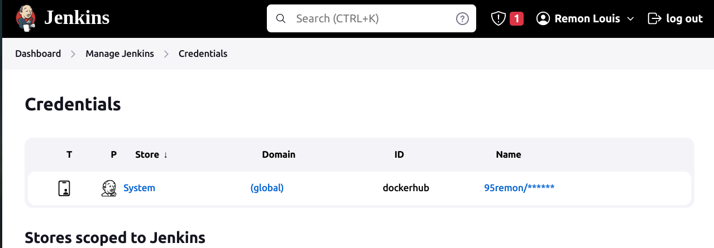
    - 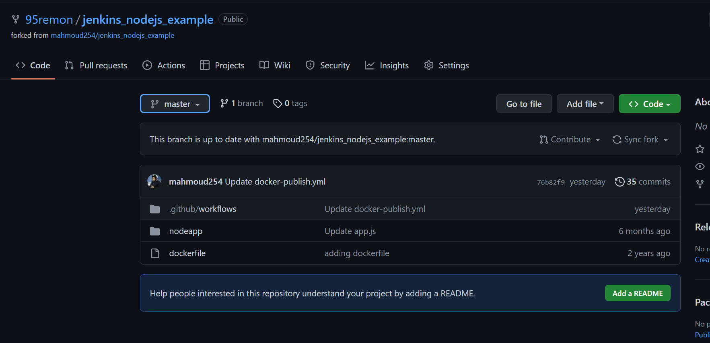
    - 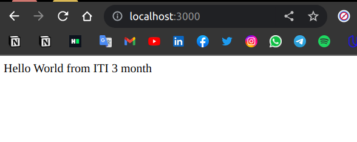

<br/>

---

<br/>

# Jenkins-ITI Day2-Lab3

<br/>

1. create docker file to build image for jenkins slave
    ```dockerfile
    FROM ubuntu

    USER root

    RUN mkdir -p jenkins_home
    RUN chmod 777 jenkins_home

    ENV DEBIAN_FRONTEND noninteractive
    ENV TZ=Africa/Cairo

    RUN apt-get update

    RUN apt-get install -y tzdata

    RUN apt-get install -y openjdk-11-jdk

    RUN apt-get install -y openssh-server


    # Install dependencies required to install Docker
    RUN apt-get install -y apt-transport-https ca-certificates curl gnupg-agent software-properties-common

    # Add the Docker GPG key
    RUN curl -fsSL https://download.docker.com/linux/ubuntu/gpg | apt-key add -

    # Add the Docker repository
    RUN add-apt-repository "deb [arch=amd64] https://download.docker.com/linux/ubuntu $(lsb_release -cs) stable"

    # Update the package repository again
    RUN apt-get update

    # Install Docker
    RUN apt-get install -y docker-ce docker-ce-cli containerd.io

    # Verify the Docker installation
    RUN docker --version

    RUN useradd -ms /bin/bash jenkins
    RUN usermod -aG docker jenkins

    WORKDIR jenkins_home

    CMD [ "/bin/bash" ]
    ```
    
<br/>


2. create container from this image and configure ssh 
    ```bash
    sudo docker build -t jenkins-slave-image:v1 .
    ```
    ```bash
    sudo docker run -d --name jenkins-slave-container -it jenkins-slave-image:v1
    ```
    open container and run
    ```bash
    ssh-keygen
    ```
    to generate the key

<br/>
    

3. from jenkins maste create new node with the slave container
    - create jenkins credentials with the ssh host and username and the key then use it into the node configrations
    - 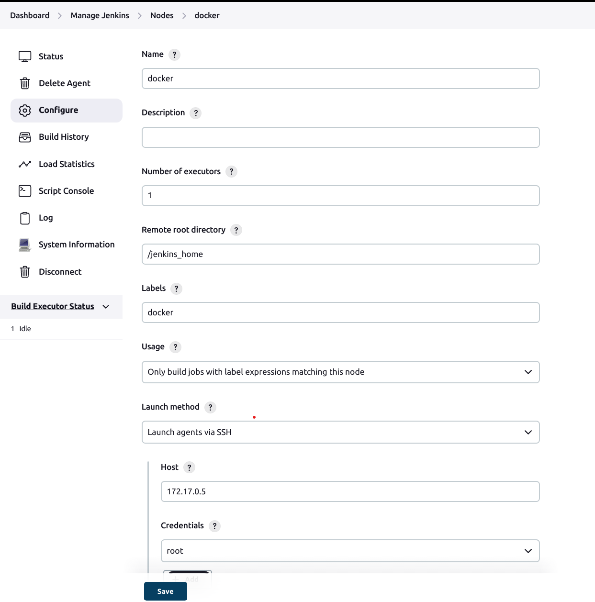
    - 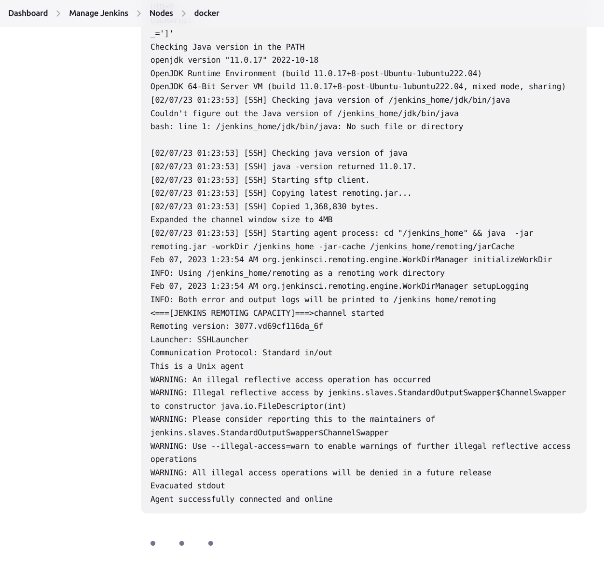


<br/>
   
4. integrate slack with jenkins

    - 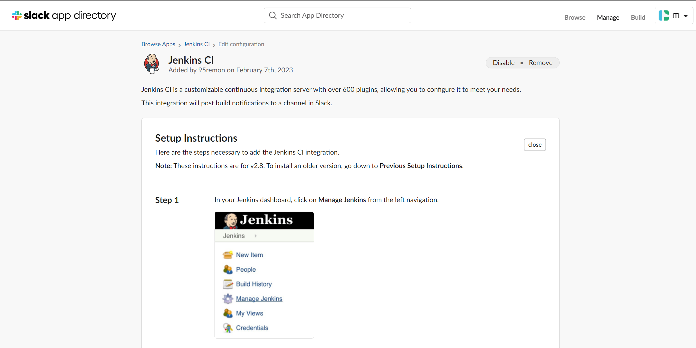
    - 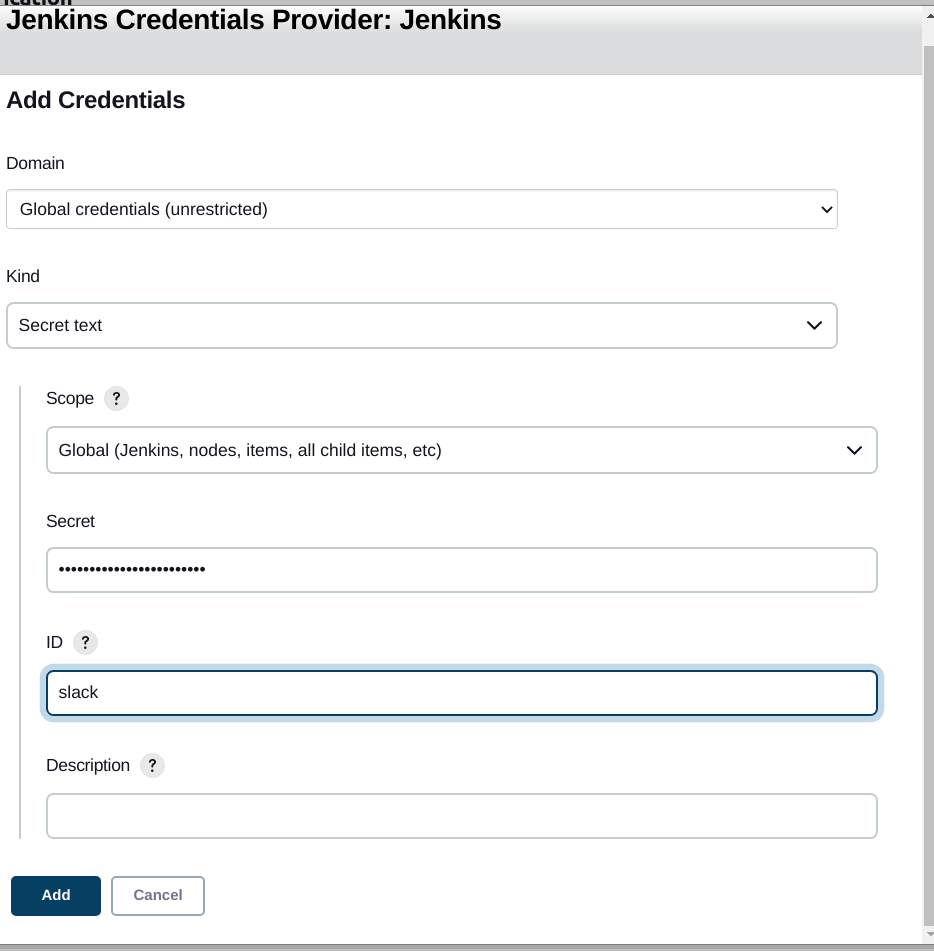
    - 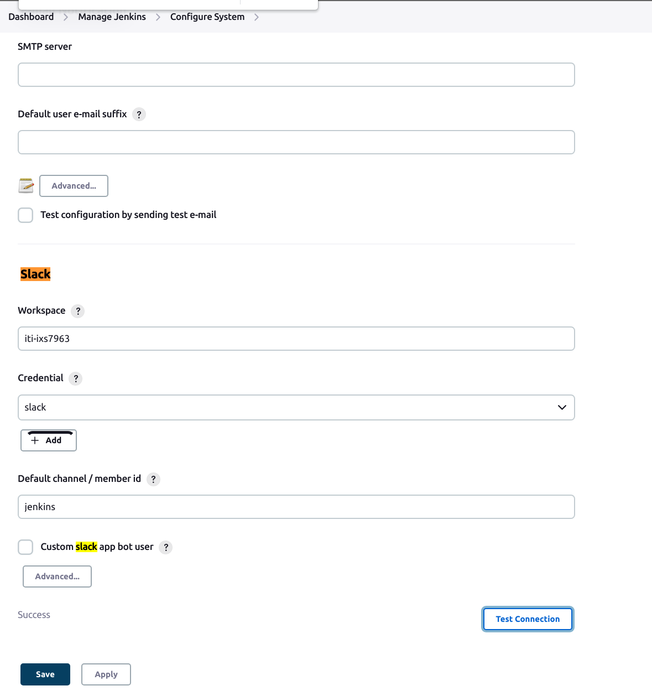

<br/>


5. send slack message when stage in your pipeline is successful
    add this code to the pipline 
    ```groovy
    post {
        success {
            slackSend color: 'good', message: "Build succeeded! Visit ${env.BUILD_URL}"
        }
        failure {
            slackSend color: 'danger', message: "Build failed! Check the logs at ${env.BUILD_URL}"
        }
    }
    ```
    - 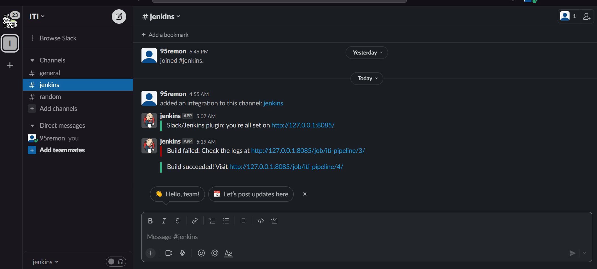

<br/>


6. install audit logs plugin and test it
   - 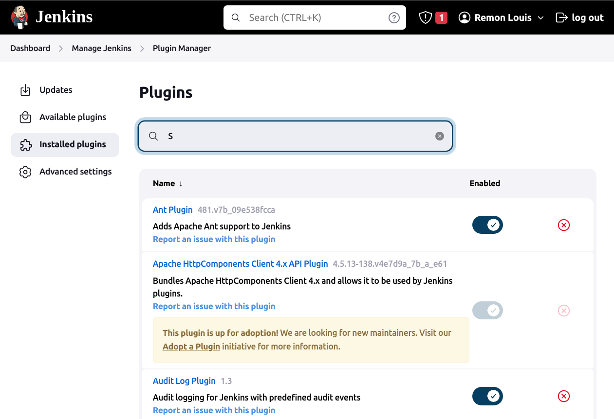
   - 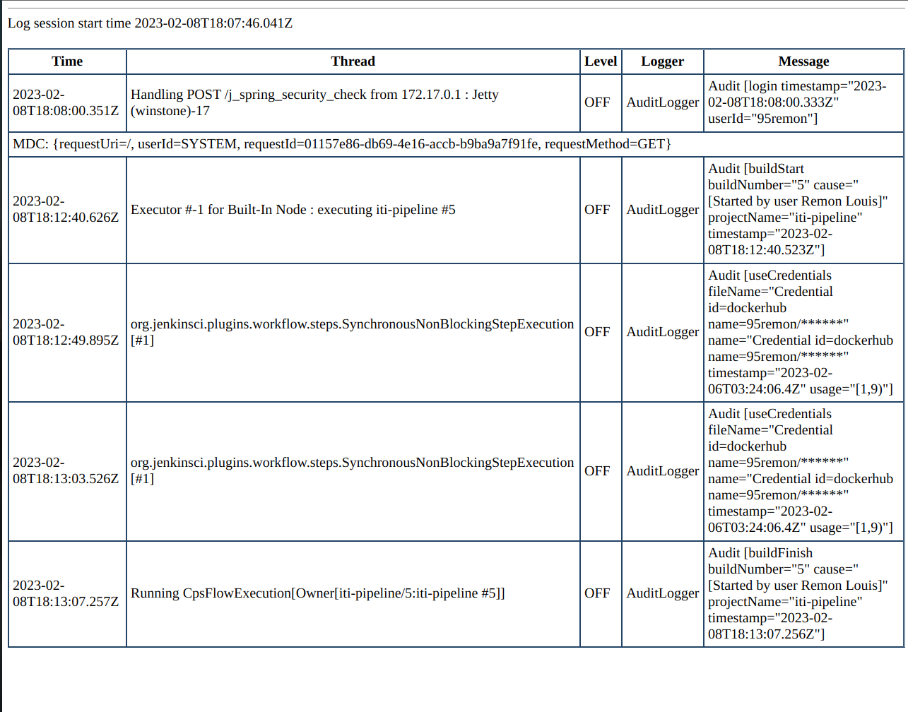

<br/>

7. fork the following repo https://github.com/mahmoud254/Booster_CI_CD_Project and add dockerfile to run this django app and use github actions to build the docker image and push it to your dockerhub

    - 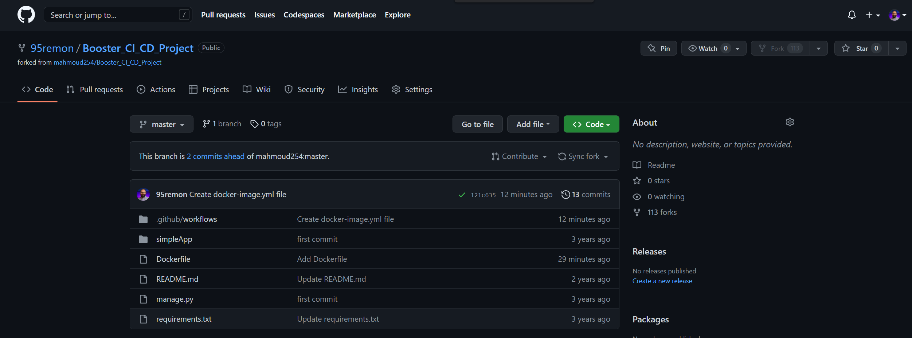
    - 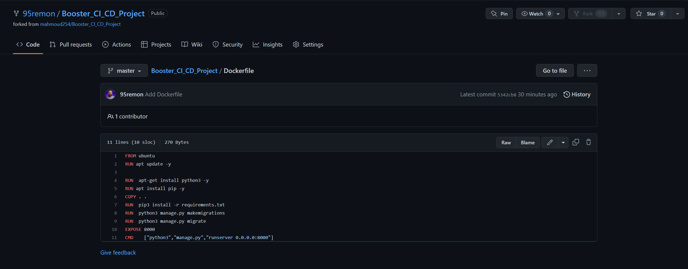
    - 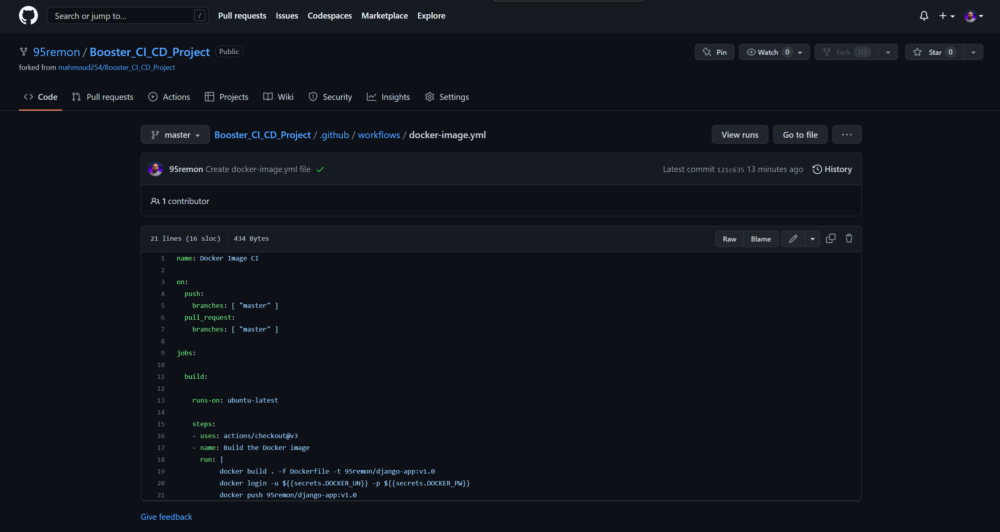
    - 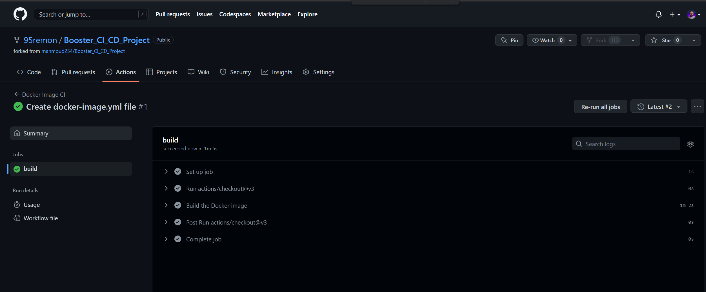
    - 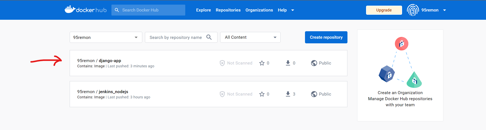
